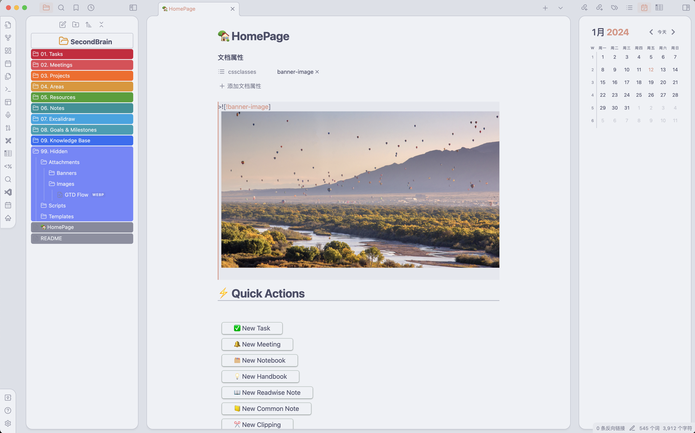
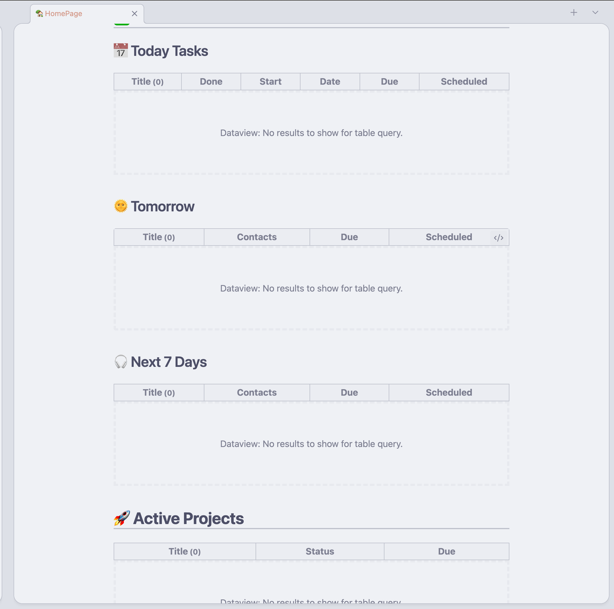
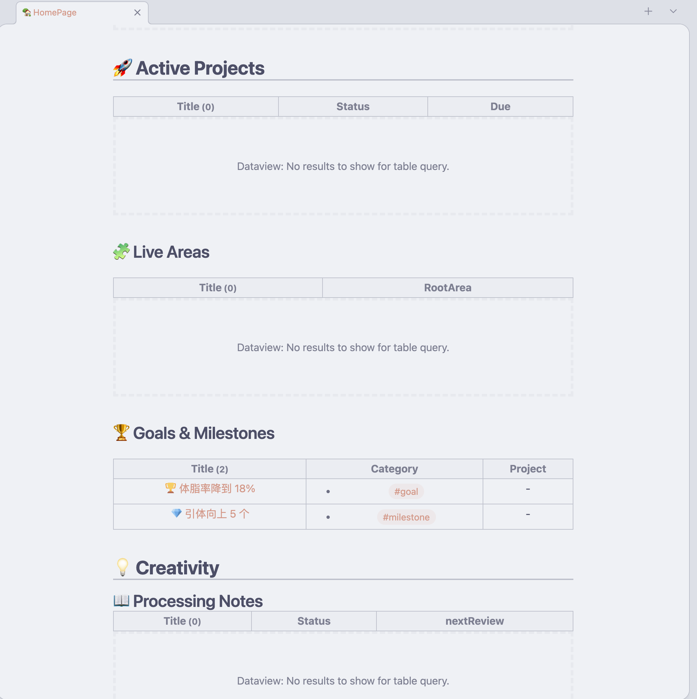

# 使用 OB 构建个人第二大脑

## 说明
这里是我使用 Obsidian 配置个人第二大脑的模板配置，核心理念聚焦在 GTD 工作方法与 P.A.R.A 的信息组织方式。
结合自身使用体验，我整理这一版的 OB 第二大脑。

## 使用方式
1. 下载仓库到本地
2. 安装 Obsidian，可以直接登陆 obsidian.md 下载相应的软件
3. 打开 obsidian，选择打开仓库，英文应该是 'open vault', 选择刚才下载到本地的仓库
4. `🏡 HomePage` 是第二大脑的首页，集成了所有快捷创建包括 “任务” “笔记” “项目” “资源” 等的按钮，使用 dataview 实现了快速预览任务，笔记等

## 截图

